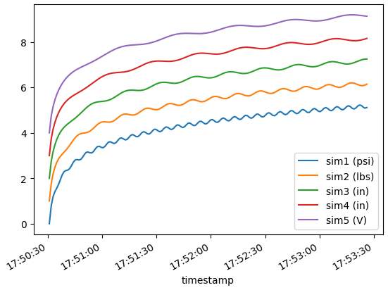

# LabVIEW DAQ Application Template

## Usage

1. Install LabVIEW 2021 or later
1. Open the lvproj
1. Open Main.vi
1. Run

## Preview


## Configuration

- Plots
  - name
  - device
  - calibration
- Timing
  - software-timed intervals
  - one sample per interval
  - intervals can be repeated and sequenced
  - additional samples on-button-click while running
- Logging
  - CSV format
  - create or overwrite log file
  - append to existing log file

## Data

```csv
Date,2023-04-21
Start time,17:50:30.959
timestamp,sim1 (psi),sim2 (lbs),sim3 (in),sim4 (in),sim5 (V)
2023-04-21T17:50:30.958-07:00,0.0000,1.0000,2.0000,3.0000,4.0000
2023-04-21T17:50:32.010-07:00,0.7880,1.7587,2.7460,3.7393,4.7353
2023-04-21T17:50:33.010-07:00,1.1866,2.1841,3.1663,4.1550,5.1476
2023-04-21T17:50:34.010-07:00,1.4063,2.4791,3.4672,4.4544,5.4450
2023-04-21T17:50:35.010-07:00,1.5566,2.6916,3.6978,4.6876,5.6777
2023-04-21T17:50:36.010-07:00,1.7250,2.8466,3.8799,4.8766,5.8682
```

```python
import pandas as pd

data = pd.read_csv(
    "data_log.csv",
    header=2,
    parse_dates=["timestamp"],
)

print(f"shape{data.shape}")
print(data.head())
axes = data.plot.line(x="timestamp")
```

> ```
> shape(173, 6)
>
>                          timestamp  sim1 (psi)  sim2 (lbs)  sim3 (in)  sim4 (in)  sim5 (V)
> 0 2023-04-21 17:50:30.958000-07:00      0.0000      1.0000     2.0000     3.0000    4.0000
> 1 2023-04-21 17:50:32.010000-07:00      0.7880      1.7587     2.7460     3.7393    4.7353
> 2 2023-04-21 17:50:33.010000-07:00      1.1866      2.1841     3.1663     4.1550    5.1476
> 3 2023-04-21 17:50:34.010000-07:00      1.4063      2.4791     3.4672     4.4544    5.4450
> 4 2023-04-21 17:50:35.010000-07:00      1.5566      2.6916     3.6978     4.6876    5.6777
> ```
>
> 

## Changelog

### Baseline

LabVIEW sample project: Continuous Measurement and Logging

- Launch LabVIEW and select Create Project. From the Create Project dialog, launch the Continuous Measurement and Logging sample project.
- NI site: https://www.ni.com/en-us/support/documentation/supplemental/21/using-a-queued-message-handler-in-labview.html
- LV wiki: https://labviewwiki.org/wiki/Design_pattern

### Changes

- Make the root container for Aquired Data.ctl a cluster
- Use typedefs in the data queues/notifiers rather than raw constants
- Add 'Exit' user-action to main UI error handler
- Add overwrite-log/append-log/timestamp-log tab control to Settings Dialog
- Switch to spreadsheet log format
- Add Diagnostics subsystem loop
- Add Interval Timer subsystem
- Add "Save Now" button and behavior
- Add Acquisition Status loop and countdown
- Add multi-channel support
- Implement data calibration
- Implement per channel null-offset
- Add log file path control to main UI
- Detect software and hardware resources on host system
